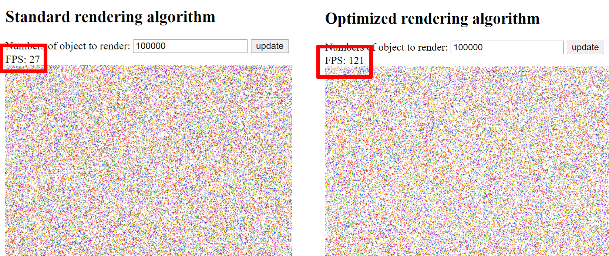
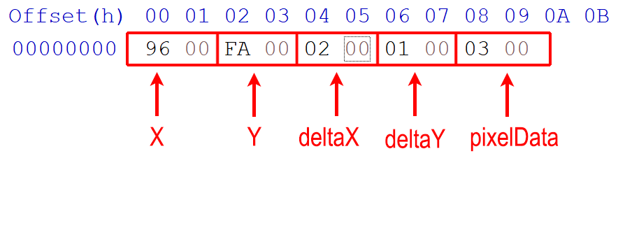

# Description

This project explores techniques to optimize JavaScript rendering algorithms for massive datasets (up to 1 million objects) by leveraging the efficiency of Uint8Array iteration. This approach significantly reduces rendering lag and improves user experience in web applications with large amounts of visual data.

# How does it work

When it comes to iterating over elements, Uint8Arrays and Uint16Arrays generally offer better performance compared to regular JavaScript arrays. Here's why:

- Memory Layout: Uint8Arrays store elements in a contiguous block of memory due to their fixed size and uniform data type. This allows the CPU to access elements more efficiently compared to regular arrays which can have scattered elements in memory.
- Optimized Operations: JavaScript engines can perform optimizations specifically for iterating over typed arrays. These optimizations might involve vectorized instructions (SIMD) that process multiple elements at once, leading to significant speedups for large datasets.

By creating object in 16bit binary format (Uint16Array) When the javascript engine sees a Uint16Array, it recognizes the fixed size and uniform data type. This allows for optimizations like:
- SIMD (Single Instruction, Multiple Data): Processing multiple elements simultaneously can be much faster on modern CPUs. Uint16Arrays are ideal for SIMD operations because all elements are the same size and type.
- Memory Access Patterns: Knowing the data type and fixed size helps the engine predict memory access patterns, leading to more efficient memory management.

# Rendering algorithms

This project utilizes Uint16Array data structures to store object data. Uint16Arrays offer efficient memory access patterns due to their fixed-size, single-byte elements. This characteristic significantly improves iteration performance compared to traditional JavaScript objects, especially when dealing with large datasets.

The render algorithms would process all object data stored in the Uint16Array and convert it into a bitmap format for efficient manipulation.

